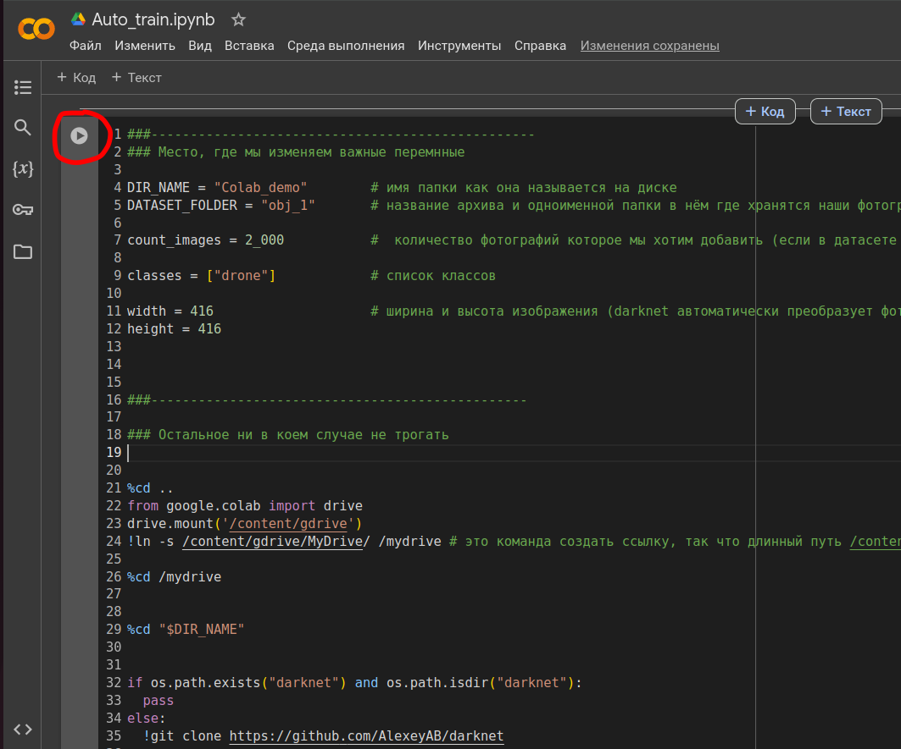

### Установка Colaboratory

1. Заходим на свой гугл диск
2. Наживаем на плюсик "Установить доплнения"

    
 
  
3. В поисковике вводим Colaboratory и устанавливаем


### Подготовительные работы
1. Создаём новую папку в гугл диске


Называем Colab_demo  (или как вам угодно)


Видим, что папка создалась


2. Заходим в эту папку, правый клик мышкой и выбираем "Загрузить файлы" и выбираем файл "Auto_train.ipynb"


3. Также через загрузку файла загружаем наш датасет


### Немного про датасет
1. Обязательно загружаем на наш гугл диск датасет в виде архива, иначе загрузка будет долгой
2. Архив должен быть в формате zip и содержать внутри себя одноименную папку с данными (пример см. ниже)


3. Содержимое папки  obj_1 :


Должны быть только фотографии и одноимееные к ним текстовые файлы с метками
Notes: аннотации должны быть в формате Yolo darknet или (Yolo v4 darknet)
файл txt выглядит обычно так: 0 0.4953125 0.453125 0.990625 0.715625   (т.е. размеры всегда начинаются с 0 целых)


### Где достать данные для обучения?
1. Самое главное, что размечать самим ничего не надо, т. к. детекция дронов довольно популярная задача и для нее много уже готового материала
2. В интернете есть много ресурсов, где можно скачать готовые наборы данных


## 1.  [Roboflow](https://universe.roboflow.com/search?q=drones) <-- кликни
1. Выбираем нужный проект и скачиваем его


2. Наживаем "Download Dataset"  


3. Обязательно выбираем такой формат сохранения

4. Continue и ждем завершения загрузки

5. После загрузки получаем такую картину 

Так как фотографий в данном датасете больше 10_000 что уже много, то нам достаточно взять всего одну (не обязательно train) из трех папок, сжать ее в zip и загрузить в гугл диск

## 2. [Kaggle](https://www.kaggle.com/datasets/muki2003/yolo-drone-detection-dataset/data)


### Работа в Google Colab
1. Открываем наш файл Auto_train.ipynb


2. Настройка среды выполнения


2. В файле есть основная часть с параметрами, которые очень важно правильно настроить


3. Остальная часть программы настроена на автоматическое и последовательное выполнение команд

4. Запускаем выполнение программы


5. Нужно будет разрешить блокноту доступ к гугл диску


6. Со временем должен появиться такой вывод


7. Далеко не отходим от пк, т.к. за бездействие вас могут отключить от виртуальной машины или может появиться капча


Чтобы это избежать нажмите CTRL + SHIFT + i, чтобы открыть консоль браузера.

Вставьте следующий код в консоль и нажмите Enter.

```
function ClickConnect(){
console.log("Working");
document
  .querySelector('#top-toolbar > colab-connect-button')
  .shadowRoot.querySelector('#connect')
  .click()
}
ClickConnect();
const interval_id = setInterval(ClickConnect, 60*1000);
```


### Конечная структура

В папке "backup" будут появляться веса
